# ir-icons

<!-- Auto Generated Below -->

## Properties

| Property       | Attribute        | Description | Type                                                                                                                                                                                                                                                                                                                                                                                                                                                                                                        | Default     |
| -------------- | ---------------- | ----------- | ----------------------------------------------------------------------------------------------------------------------------------------------------------------------------------------------------------------------------------------------------------------------------------------------------------------------------------------------------------------------------------------------------------------------------------------------------------------------------------------------------------- | ----------- |
| `name`         | `name`           |             | `"search" \| "clock" \| "wifi" \| "car" \| "pets" \| "bed" \| "hotel" \| "utencils" \| "credit_card" \| "check" \| "danger" \| "bell" \| "football" \| "burger_menu" \| "home" \| "xmark" \| "snowflake" \| "sun" \| "minus" \| "user" \| "heart" \| "dimensions" \| "user_group" \| "smoking" \| "ban_smoking" \| "double_bed" \| "arrow_right" \| "arrow_left" \| "circle_info" \| "calendar" \| "child" \| "globe" \| "facebook" \| "twitter" \| "whatsapp" \| "instagram" \| "youtube" \| "angle_left"` | `undefined` |
| `svgClassName` | `svg-class-name` |             | `string`                                                                                                                                                                                                                                                                                                                                                                                                                                                                                                    | `undefined` |

## Dependencies

### Used by

 - [ir-accomodations](../../ir-booking-engine/ir-booking-page/ir-accomodations)
 - [ir-adult-child-counter](../../ir-booking-engine/ir-booking-page/ir-adult-child-counter)
 - [ir-availibility-header](../../ir-booking-engine/ir-booking-page/ir-availibility-header)
 - [ir-badge-group](../ir-badge-group)
 - [ir-booking-details](../../ir-booking-engine/ir-checkout-page/ir-booking-details)
 - [ir-checkout-page](../../ir-booking-engine/ir-checkout-page)
 - [ir-coupon-dialog](../../ir-booking-engine/ir-booking-page/ir-availibility-header/ir-coupon-dialog)
 - [ir-date-popup](../../ir-booking-engine/ir-booking-page/ir-availibility-header/ir-date-popup)
 - [ir-dialog](../ir-dialog)
 - [ir-facilities](../../ir-booking-engine/ir-booking-page/ir-facilities)
 - [ir-footer](../../ir-booking-engine/ir-footer)
 - [ir-loyalty](../../ir-booking-engine/ir-booking-page/ir-availibility-header/ir-loyalty)
 - [ir-nav](../../ir-booking-engine/ir-nav)
 - [ir-phone-input](../ir-phone-input)
 - [ir-pickup](../../ir-booking-engine/ir-checkout-page/ir-pickup)
 - [ir-property-gallery](../../ir-booking-engine/ir-booking-page/ir-property-gallery)
 - [ir-room-type-amenities](../../ir-booking-engine/ir-booking-page/ir-room-type-amenities)

### Graph

```mermaid
graph TD;
  ir-accomodations --> ir-icons
  ir-adult-child-counter --> ir-icons
  ir-availibility-header --> ir-icons
  ir-badge-group --> ir-icons
  ir-booking-details --> ir-icons
  ir-checkout-page --> ir-icons
  ir-coupon-dialog --> ir-icons
  ir-date-popup --> ir-icons
  ir-dialog --> ir-icons
  ir-facilities --> ir-icons
  ir-footer --> ir-icons
  ir-loyalty --> ir-icons
  ir-nav --> ir-icons
  ir-phone-input --> ir-icons
  ir-pickup --> ir-icons
  ir-property-gallery --> ir-icons
  ir-room-type-amenities --> ir-icons
  style ir-icons fill:#f9f,stroke:#333,stroke-width:4px
```

----------------------------------------------

*Built with [StencilJS](https://stenciljs.com/)*
