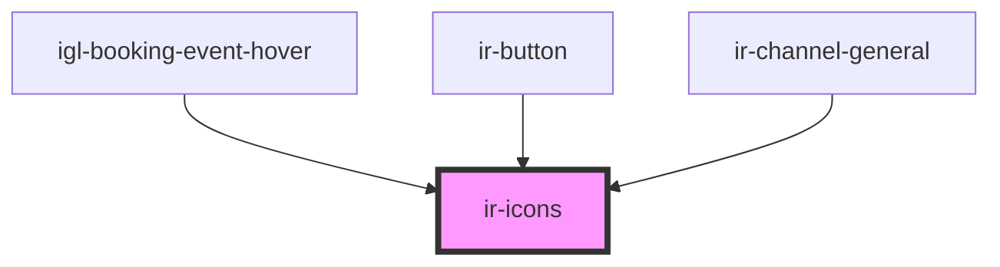

# ir-icons

<!-- Auto Generated Below -->

## Properties

| Property       | Attribute        | Description | Type                                                                                                                                                                                                                                                                                                                                                                                                                                                                                                                                                                                        | Default     |
| -------------- | ---------------- | ----------- | ------------------------------------------------------------------------------------------------------------------------------------------------------------------------------------------------------------------------------------------------------------------------------------------------------------------------------------------------------------------------------------------------------------------------------------------------------------------------------------------------------------------------------------------------------------------------------------------- | ----------- |
| `name`         | `name`           |             | `"print" \| "save" \| "check" \| "user" \| "search" \| "danger" \| "clock" \| "bell" \| "burger_menu" \| "home" \| "xmark" \| "minus" \| "heart" \| "user_group" \| "arrow_right" \| "arrow_left" \| "circle_info" \| "calendar" \| "globe" \| "facebook" \| "twitter" \| "whatsapp" \| "instagram" \| "youtube" \| "angle_left" \| "circle_check" \| "eraser" \| "file" \| "edit" \| "trash" \| "plus" \| "reciept" \| "menu_list" \| "credit_card" \| "closed_eye" \| "open_eye" \| "server" \| "double_caret_left" \| "square_plus" \| "angles_left" \| "angle_right" \| "angles_right"` | `undefined` |
| `svgClassName` | `svg-class-name` |             | `string`                                                                                                                                                                                                                                                                                                                                                                                                                                                                                                                                                                                    | `undefined` |

## Dependencies

### Used by

 - [igl-booking-event-hover](../../igloo-calendar/igl-booking-event-hover)
 - [ir-button](../../ir-button)
 - [ir-channel-general](../../ir-channel/ir-channel-general)

### Graph

----------------------------------------------

*Built with [StencilJS](https://stenciljs.com/)*
