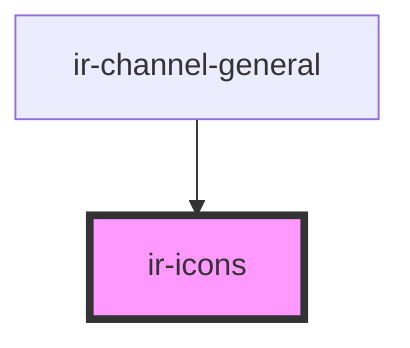

# ir-icons

<!-- Auto Generated Below -->

## Properties

| Property       | Attribute        | Description | Type     | Default     |
| -------------- | ---------------- | ----------- | -------- | ----------- |
| `name`         | `name`           |             | `string` | `undefined` |
| `svgClassName` | `svg-class-name` |             | `string` | `undefined` |

## Dependencies

### Used by

 - [ir-channel-general](../../ir-channel/ir-channel-general)

### Graph

----------------------------------------------

*Built with [StencilJS](https://stenciljs.com/)*
