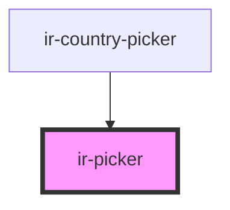

# ir-picker

<!-- Auto Generated Below -->

## Properties

| Property       | Attribute       | Description                                                                           | Type                                          | Default     |
| -------------- | --------------- | ------------------------------------------------------------------------------------- | --------------------------------------------- | ----------- |
| `appearance`   | `appearance`    | The input's visual appearance.                                                        | `"filled" \| "filled-outlined" \| "outlined"` | `undefined` |
| `defaultValue` | `default-value` | The default value of the form control. Primarily used for resetting the form control. | `string`                                      | `undefined` |
| `label`        | `label`         | Optional label applied to the text field.                                             | `string`                                      | `undefined` |
| `loading`      | `loading`       |                                                                                       | `boolean`                                     | `false`     |
| `mode`         | `mode`          |                                                                                       | `"default" \| "select"`                       | `'default'` |
| `pill`         | `pill`          |                                                                                       | `boolean`                                     | `false`     |
| `placeholder`  | `placeholder`   | Placeholder shown inside the input when there is no query.                            | `string`                                      | `''`        |
| `size`         | `size`          | The input's size.                                                                     | `"large" \| "medium" \| "small"`              | `undefined` |
| `value`        | `value`         | Selected value (also shown in the input when `mode="select"`).                        | `string`                                      | `''`        |

## Events

| Event             | Description | Type                                       |
| ----------------- | ----------- | ------------------------------------------ |
| `combobox-select` |             | `CustomEvent<IrComboboxSelectEventDetail>` |

## Methods

### `close() => Promise<void>`

#### Returns

Type: `Promise<void>`

### `open() => Promise<void>`

#### Returns

Type: `Promise<void>`

## Dependencies

### Used by

 - [ir-country-picker](../ir-country-picker)

### Graph

----------------------------------------------

*Built with [StencilJS](https://stenciljs.com/)*
