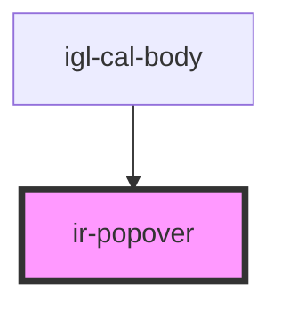

# ir-popover

<!-- Auto Generated Below -->

## Properties

| Property        | Attribute         | Description | Type     | Default     |
| --------------- | ----------------- | ----------- | -------- | ----------- |
| `irPopoverLeft` | `ir-popover-left` |             | `string` | `'10px'`    |
| `popoverTitle`  | `popover-title`   |             | `string` | `undefined` |

<<<<<<< HEAD:src/components/ir-popover/readme.md
=======
## Dependencies

### Used by

 - [igl-cal-body](../../igloo-calendar/igl-cal-body)

### Graph

>>>>>>> main:src/components/ui/ir-popover/readme.md
----------------------------------------------

*Built with [StencilJS](https://stenciljs.com/)*
